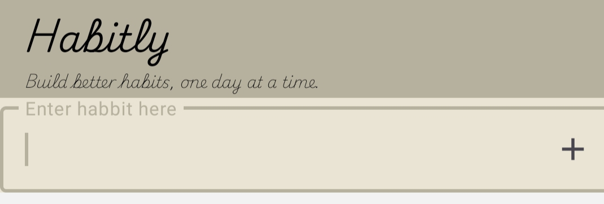
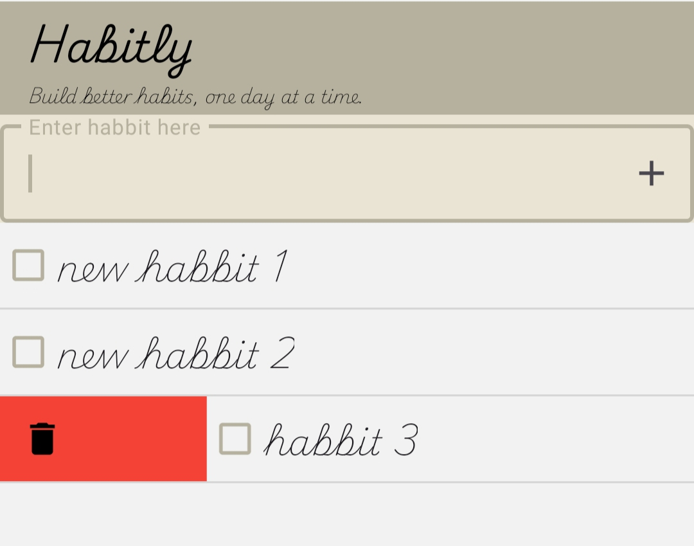
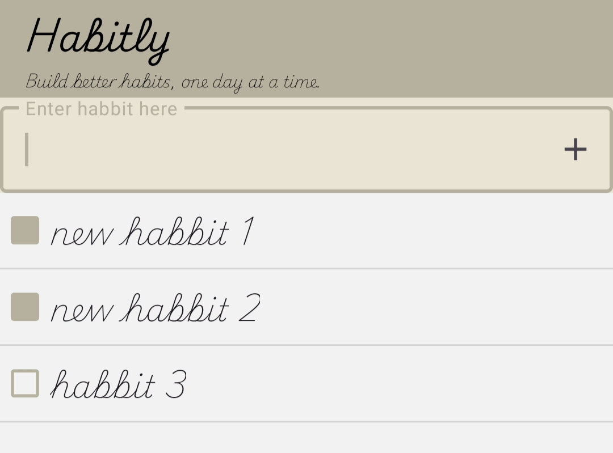

# Habitly 🧠✅

**Habitly** is a minimal and elegant habit-tracking Android app built in **Kotlin** using **Material Design** components. It's designed to help you build better routines by keeping your habits organized, interactive, and fun.

---

## ✨ Features

- ✅ Add and track daily habits with checkboxes  
- 🗑️ Swipe-to-delete habits (with undo via Snackbar)  
- 📝 Real-time RecyclerView updates  
- 🎯 Material design UI  
- 💾 SharedPreferences for data persistence (optional Room integration later)  
- ☑️ Customizable checkboxes with tick and color themes  

---

## 📸 Screenshots

| Add Habits | Swipe to Delete | Minimal UI |
|------------|------------------|-------------|
|  |  |  |

> 📁 Put your screenshots inside a `screenshots/` folder in the repo.

---

## 🛠️ Tech Stack

- Kotlin  
- AndroidX  
- Material Components  
- RecyclerView  
- SharedPreferences  
- ItemTouchHelper

---

## 🚀 Getting Started

1. Clone this repo:
   ```bash
   git clone https://github.com/your-username/Habitly.git
